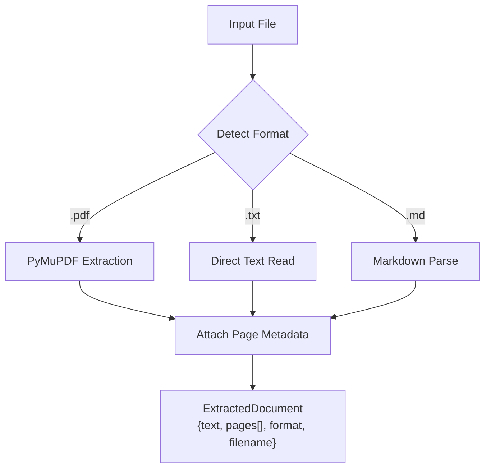
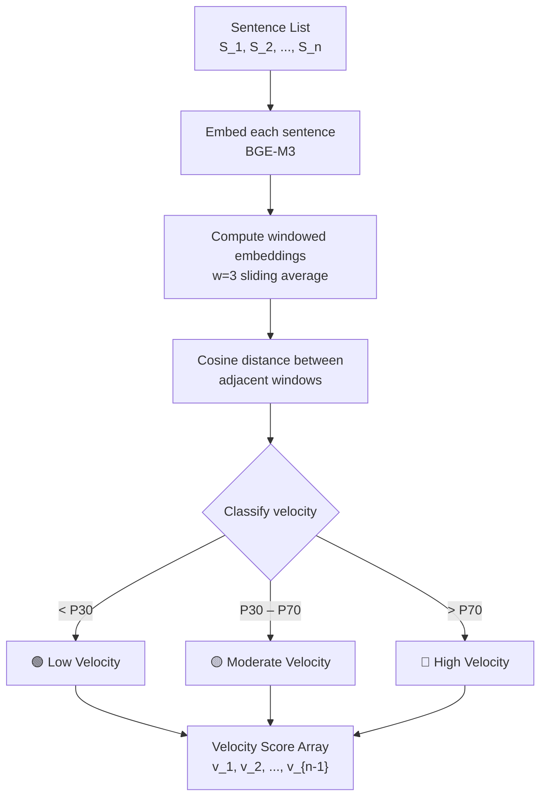
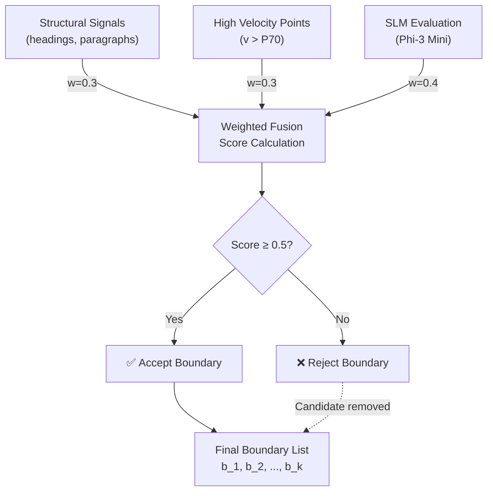
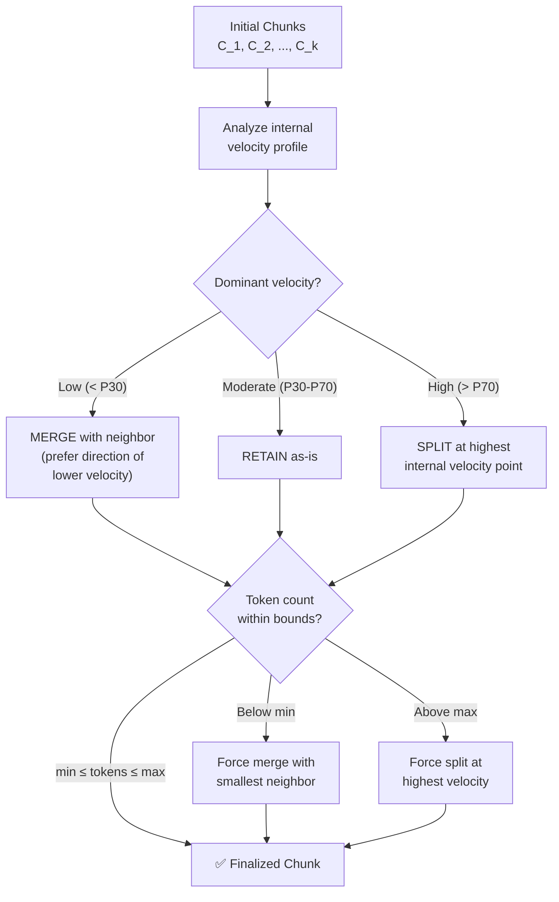
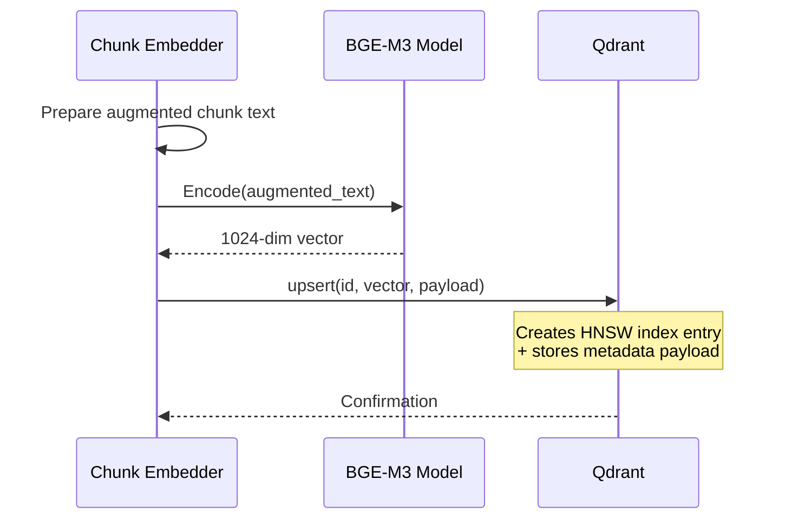
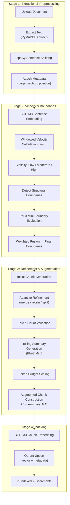

# Phase I Design: Context-Augmented Agentic Chunking (CAAC)

## 1. Overview

Phase I transforms raw documents into semantically coherent, context-augmented chunks stored in a vector database. Unlike fixed-size chunking, CAAC uses SLM-guided boundary detection combined with a novel semantic velocity metric to produce chunks that respect document structure and preserve cross-section context through rolling summaries.


---

## 2. Document Ingestion Pipeline

### 2.1 Text Extraction

**Module**: `src/ingestion/extractors.py`

The extraction layer supports three input formats:

| Format | Library | Strategy |
|---|---|---|
| PDF | `PyMuPDF` (fitz) | Page-by-page text extraction with layout preservation |
| Text | Built-in `open()` | Direct read with encoding detection |
| Markdown | `markdown` + `BeautifulSoup` | Parse to HTML, extract text while preserving structure |

**Output**: Raw text string + page-level metadata.



### 2.2 Preprocessing

**Module**: `src/ingestion/preprocessor.py`

The preprocessing pipeline uses spaCy to transform raw text into structured sentence-level units:

1. **Sentence Splitting**: spaCy's `sentencizer` component segments text into sentences.
2. **Tokenization**: Each sentence is tokenized for downstream analysis.
3. **Metadata Attachment**: Each sentence receives metadata:
   - `sentence_id`: Sequential integer within the document
   - `page_number`: Source page (from extraction metadata)
   - `section_title`: Detected heading or section name
   - `paragraph_index`: Paragraph position within the section
   - `token_count`: Number of tokens in the sentence
   - `char_offset`: Character offset from document start

### 2.3 Document Data Model

**Module**: `src/ingestion/document.py`

```python
@dataclass
class Sentence:
    sentence_id: int
    text: str
    page_number: int
    section_title: str
    paragraph_index: int
    token_count: int
    char_offset: int
    embedding: Optional[np.ndarray] = None

@dataclass
class PreprocessedDocument:
    doc_id: str
    filename: str
    doc_type: str          # "legal" | "academic" | "technical" | "policy"
    total_pages: int
    sentences: List[Sentence]
    sections: List[str]    # Ordered list of section titles
```

---

## 3. Semantic Velocity Calculation

### 3.1 Concept

**Module**: `src/chunking/semantic_velocity.py`

Semantic velocity quantifies the magnitude of meaning shift between consecutive text segments. It is defined as the cosine distance between the embedding vectors of adjacent sentences (or sentence windows):

$$v_i = 1 - \cos(\mathbf{e}_i, \mathbf{e}_{i+1})$$

where $\mathbf{e}_i$ is the BGE-M3 embedding of sentence $i$.

### 3.2 Windowed Velocity

To reduce noise from individual sentence variations, semantic velocity is computed over sliding windows of $w$ sentences:

$$\mathbf{w}_i = \text{mean}(\mathbf{e}_i, \mathbf{e}_{i+1}, \dots, \mathbf{e}_{i+w-1})$$

$$v_i = 1 - \cos(\mathbf{w}_i, \mathbf{w}_{i+1})$$

**Default window size**: $w = 3$ sentences.

### 3.3 Velocity Classification

Velocity values are classified into three regimes using percentile-based thresholds:

| Regime | Threshold | Interpretation | Chunking Action |
|---|---|---|---|
| **Low** | $v_i < P_{30}$ | Minimal topic shift, continuous discourse | Merge with neighbors |
| **Moderate** | $P_{30} \leq v_i < P_{70}$ | Normal topic progression | Retain as-is |
| **High** | $v_i \geq P_{70}$ | Significant topic transition | Split at boundary |

> **Note:** Percentiles $P_{30}$ and $P_{70}$ are computed per-document to adapt to varying writing styles and document structures. These thresholds will be tuned during Week 6.

### 3.4 Computation Flow



---

## 4. SLM-Guided Boundary Detection

### 4.1 Approach

**Module**: `src/chunking/boundary_detector.py`

Boundary detection combines three signal sources:

1. **Structural Signals**: Document headings, numbered sections, paragraph breaks
2. **Semantic Velocity Signals**: High-velocity points indicating topic transitions
3. **SLM Analysis**: Phi-3 Mini evaluates candidate boundaries for semantic coherence

### 4.2 Structural Signal Detection

The system detects structural boundaries through:

- **Heading patterns**: Markdown headers (`#`, `##`), numbered sections (`1.`, `1.1.`, `Section 1`)
- **Paragraph breaks**: Double newlines or explicit paragraph markers
- **List boundaries**: Transitions between prose and enumerated content
- **Legal clause markers**: `Article`, `Clause`, `Section`, `Subsection`

### 4.3 SLM Boundary Evaluation

Phi-3 Mini evaluates candidate boundaries identified by velocity and structural signals. The SLM receives a context window around each candidate boundary and assesses:

- Whether the boundary represents a genuine semantic transition
- Whether splitting at this point preserves coherence on both sides
- Whether adjacent candidates should be consolidated

**Prompt Template (Academic)**:
```
You are analyzing an academic document for semantic chunking.

Consider the following text passage:
---
{preceding_text}
[CANDIDATE BOUNDARY]
{following_text}
---

Does this position represent a genuine semantic boundary? Consider:
1. Does the topic, argument, or methodology change at this point?
2. Would the text before and after this boundary each be coherent independently?
3. Is this a structural boundary (new section, new argument, new evidence)?

Respond with:
- BOUNDARY: yes/no
- CONFIDENCE: high/medium/low
- REASON: one-line explanation
```

**Prompt Template (Legal)**:
```
You are analyzing a legal document for semantic chunking.

Consider the following text passage:
---
{preceding_text}
[CANDIDATE BOUNDARY]
{following_text}
---

Does this position represent a genuine semantic boundary? Consider:
1. Does a new clause, obligation, right, or condition begin here?
2. Are defined terms or cross-references preserved on both sides?
3. Would each segment be legally interpretable independently?

Respond with:
- BOUNDARY: yes/no
- CONFIDENCE: high/medium/low
- REASON: one-line explanation
```

### 4.4 Boundary Fusion

The three signal sources are fused using a weighted scoring system:

| Signal | Weight | Rationale |
|---|---|---|
| Structural boundary detected | 0.3 | Reliable but misses implicit transitions |
| High semantic velocity at point | 0.3 | Data-driven but noisy for short segments |
| SLM confirms boundary | 0.4 | Most semantically aware but computationally expensive |

A candidate boundary is accepted when its fused score exceeds a threshold (default: 0.5).



---

## 5. Adaptive Chunk Refinement

### 5.1 Refinement Logic

**Module**: `src/chunking/adaptive_refiner.py`

After initial boundaries are established, the system refines chunks based on their internal semantic velocity profile:



### 5.2 Token Constraints

| Parameter | Default Value | Rationale |
|---|---|---|
| `min_chunk_tokens` | 64 | Minimum viable semantic unit |
| `max_chunk_tokens` | 512 | BGE-M3 context window constraint |
| `target_chunk_tokens` | 256 | Optimal embedding quality range |

### 5.3 Merge Strategy

When merging two adjacent chunks $C_i$ and $C_j$:
1. Select the neighbor with lower inter-chunk velocity
2. Concatenate text preserving original order
3. Recompute internal velocity profile
4. Verify token count is within bounds

### 5.4 Split Strategy

When splitting chunk $C_i$ at an internal high-velocity point:
1. Identify the sentence boundary with highest velocity within the chunk
2. Split into two sub-chunks at that boundary
3. Verify both sub-chunks meet minimum token count
4. If a sub-chunk is below minimum, try the next highest velocity point

---

## 6. Rolling Summary Generation

### 6.1 Mechanism

**Module**: `src/chunking/rolling_summary.py`

Each chunk $C_i$ (where $i > 1$) is augmented with a compressed summary of its preceding context window. The context window spans the previous $n$ chunks (default: $n = 3$):

$$C'_i = S_{roll}(C_{i-3}, C_{i-2}, C_{i-1}) \oplus C_i$$

where $S_{roll}$ is the Phi-3 Mini summarization function and $\oplus$ denotes prepend concatenation.

### 6.2 Summary Generation Prompt

```
Summarize the following text passages into a concise context summary.
The summary should capture:
- Key concepts and definitions introduced
- Main arguments or claims made
- Important entities, terms, or conditions referenced
- Any logical flow or dependencies between the passages

Keep the summary between {min_tokens} and {max_tokens} tokens.

Passages:
---
{chunk_i_minus_3_text}
---
{chunk_i_minus_2_text}
---
{chunk_i_minus_1_text}
---

Context Summary:
```

### 6.3 Augmented Chunk Format

The final augmented chunk stored in the vector database has the following structure:

```
[CONTEXT SUMMARY]
{rolling_summary_text}

[CONTENT]
{original_chunk_text}
```

Both the summary and content sections are embedded together by BGE-M3, producing a single dense vector that captures local meaning + global trajectory.

---

## 7. Token Budget Scaling

### 7.1 Velocity-Driven Budget

**Module**: `src/chunking/rolling_summary.py` (integrated with summary generation)

The summary token budget is dynamically scaled based on the semantic velocity at the chunk boundary:

| Velocity Regime | Summary Budget | Rationale |
|---|---|---|
| **Low** ($v < P_{30}$) | 30–50 tokens | Minimal context needed; topic is continuous |
| **Moderate** ($P_{30} \leq v < P_{70}$) | 50–100 tokens | Standard context preservation |
| **High** ($v \geq P_{70}$) | 100–150 tokens | Major topic shift requires detailed bridge |

### 7.2 Budget Formula

$$budget_i = budget_{min} + (budget_{max} - budget_{min}) \times \frac{v_i - v_{min}}{v_{max} - v_{min}}$$

where $v_i$ is the semantic velocity at the boundary preceding chunk $C_i$, and $(v_{min}, v_{max})$ are the observed velocity range for the document.

---

## 8. Vector Indexing

### 8.1 Embedding

**Module**: `src/chunking/chunk_embedder.py`

Each augmented chunk $C'_i$ is embedded using BGE-M3 to produce a dense vector:

$$\mathbf{v}_i = \text{BGE-M3}(C'_i)$$

BGE-M3 produces 1024-dimensional dense vectors.

### 8.2 Qdrant Collection Schema

```python
# Collection configuration
collection_config = {
    "collection_name": "dr_rag_chunks",
    "vectors_config": {
        "size": 1024,          # BGE-M3 embedding dimension
        "distance": "Cosine"   # Cosine similarity for retrieval
    }
}

# Per-chunk payload (metadata)
chunk_payload = {
    "doc_id": str,             # Unique document identifier
    "chunk_id": str,           # Unique chunk identifier
    "chunk_index": int,        # Sequential position in document
    "page_number": int,        # Source page number
    "section_title": str,      # Section heading
    "doc_type": str,           # "legal" | "academic" | "technical" | "policy"
    "token_count": int,        # Number of tokens in chunk
    "velocity_score": float,   # Semantic velocity at preceding boundary
    "velocity_regime": str,    # "low" | "moderate" | "high"
    "has_summary": bool,       # Whether rolling summary was prepended
    "summary_tokens": int,     # Token count of prepended summary
    "raw_text": str,           # Original chunk text (without summary)
    "augmented_text": str      # Full text (summary ⊕ chunk)
}
```

### 8.3 Indexing Flow



---

## 9. End-to-End Phase I Pipeline


