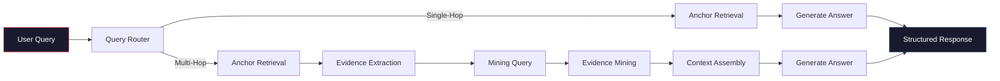
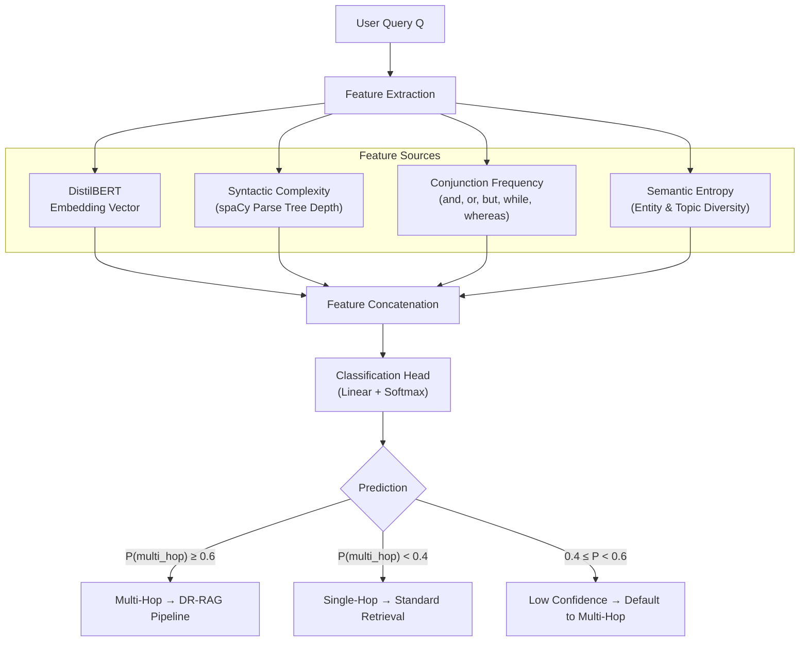
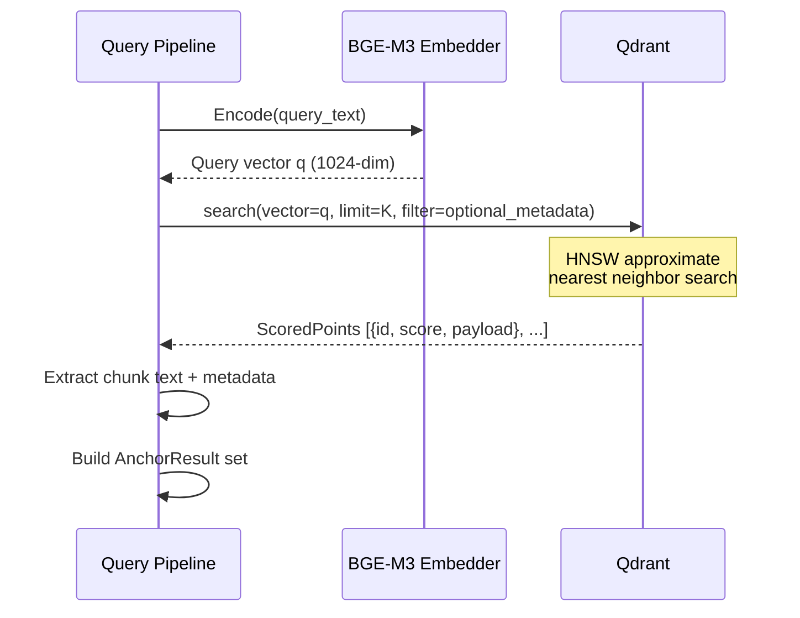
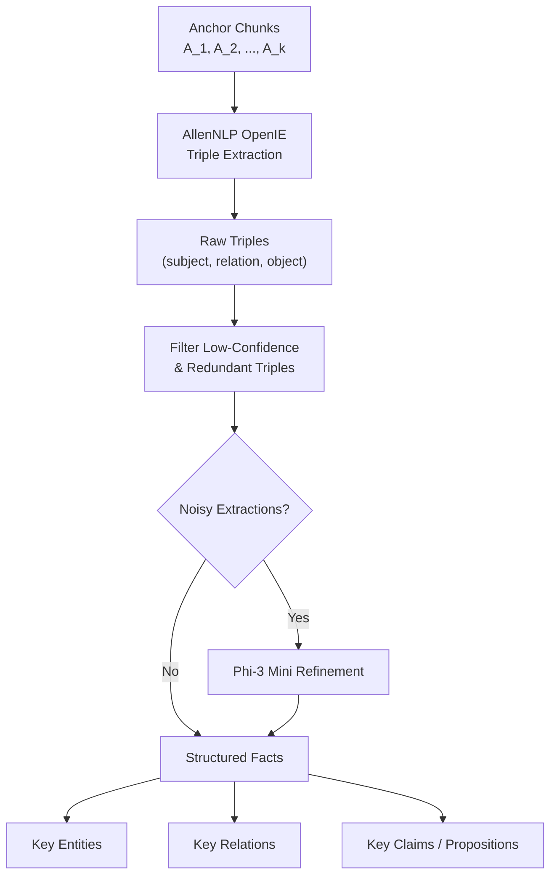
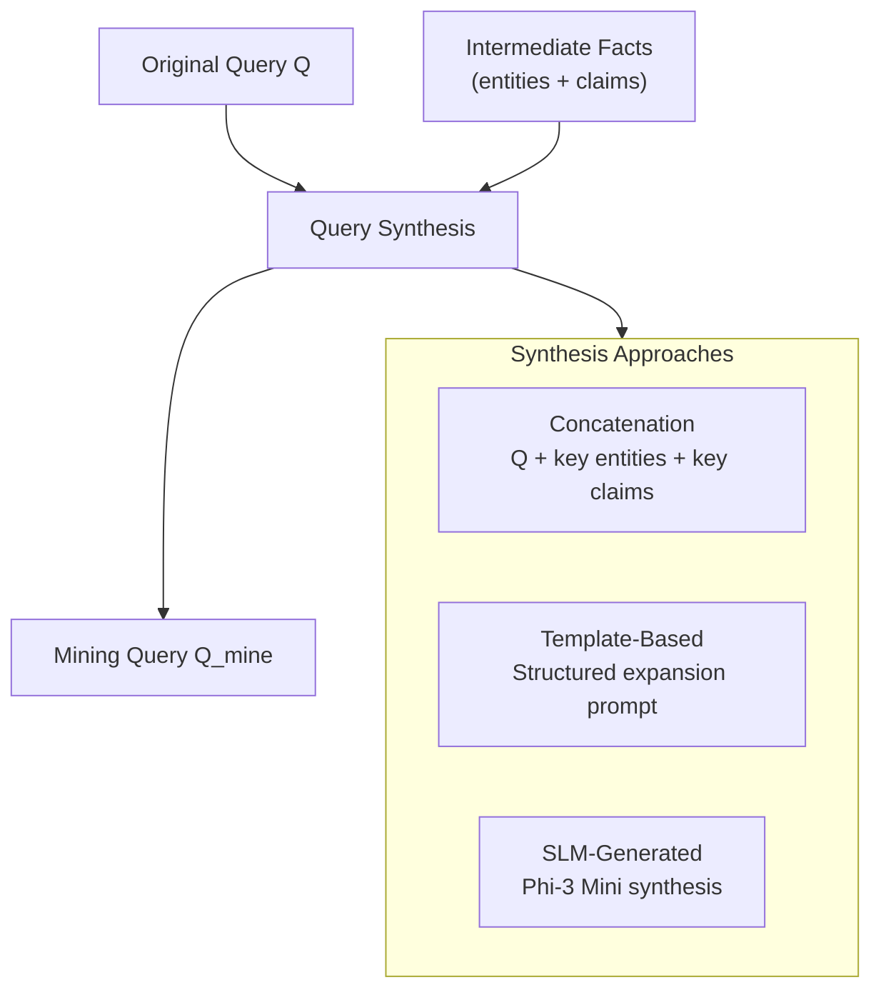
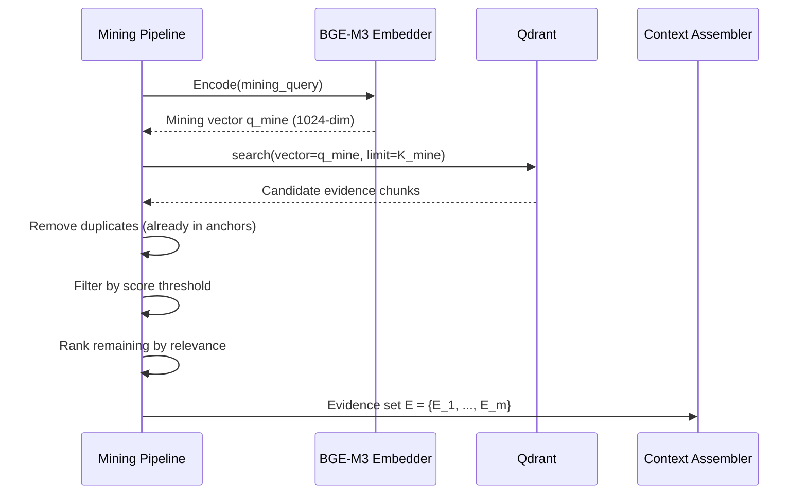
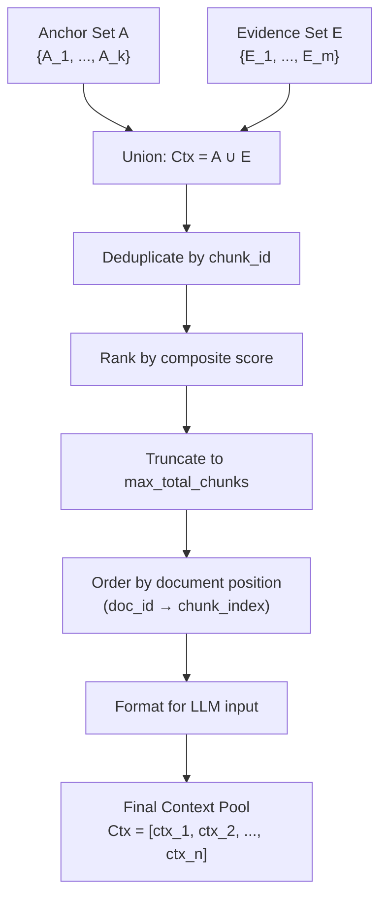
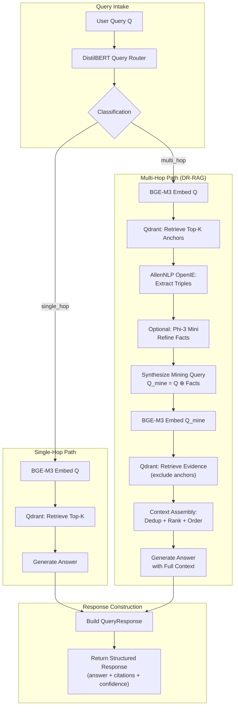
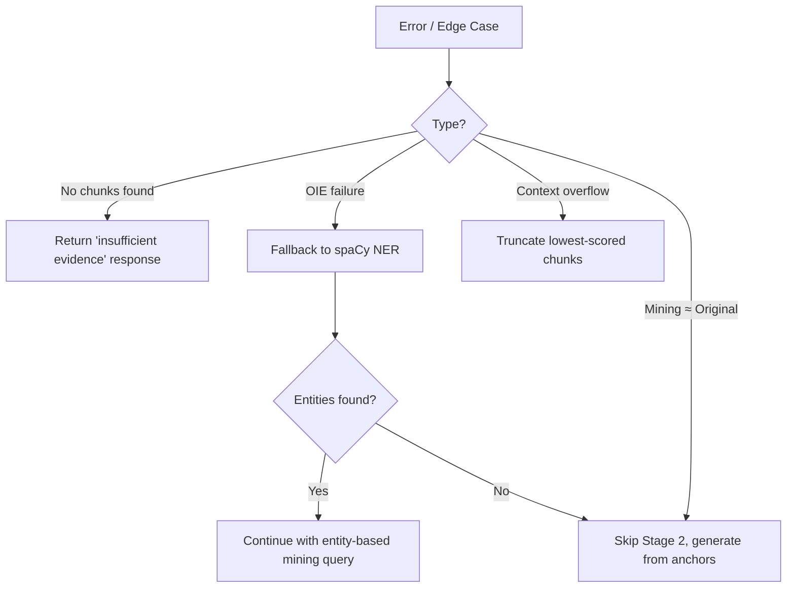

# Phase II Design: Dynamic-Relevant RAG (DR-RAG) Retrieval Pipeline

## 1. Overview

Phase II implements the query-time retrieval and generation pipeline. It receives user queries, classifies their complexity, performs single-stage or two-stage retrieval against the CAAC-indexed vector store, and generates grounded answers with source citations.



---

## 2. Query Complexity Router

### 2.1 Architecture

**Module**: `src/retrieval/query_router.py`

The query router is a binary classifier built on DistilBERT that categorizes incoming queries as `single_hop` or `multi_hop`.



### 2.2 Feature Engineering

| Feature | Extraction Method | Dimension | Rationale |
|---|---|---|---|
| **Query Embedding** | DistilBERT `[CLS]` token | 768 | Semantic representation of query intent |
| **Syntactic Depth** | spaCy dependency parse tree max depth | 1 | Deep nesting correlates with complex queries |
| **Conjunction Count** | Regex + spaCy POS tagging | 1 | Multiple conjunctions suggest multi-part questions |
| **Semantic Entropy** | Named entity count + unique topic words | 1 | Diverse entities suggest multi-hop reasoning |
| **Question Word Count** | Count of who/what/where/when/why/how | 1 | Multiple question words suggest compound queries |

**Total feature dimension**: 772

### 2.3 Training Data

| Source | Query Type | Size | Usage |
|---|---|---|---|
| **HotpotQA** | Multi-hop | ~113K questions | Primary multi-hop training data |
| **Natural Questions** | Single-hop | ~307K questions | Primary single-hop training data |
| **Manual Labels** | Mixed | ~500 examples | Domain-specific (legal + academic) fine-tuning |

### 2.4 Classification Head

```python
class QueryRouter(nn.Module):
    def __init__(self, input_dim=772, hidden_dim=256):
        super().__init__()
        self.classifier = nn.Sequential(
            nn.Linear(input_dim, hidden_dim),
            nn.ReLU(),
            nn.Dropout(0.3),
            nn.Linear(hidden_dim, 64),
            nn.ReLU(),
            nn.Dropout(0.2),
            nn.Linear(64, 2)    # [single_hop, multi_hop]
        )

    def forward(self, features):
        logits = self.classifier(features)
        return F.softmax(logits, dim=-1)
```

### 2.5 Fallback Logic

When the classifier confidence is low ($0.4 \leq P_{multi\_hop} < 0.6$), the system defaults to the multi-hop pipeline. This is a conservative design choice: running the two-stage pipeline on a single-hop query adds latency but does not degrade answer quality, whereas missing a genuine multi-hop query would produce incomplete answers.

---

## 3. Stage 1: Anchor Retrieval

### 3.1 Mechanism

**Module**: `src/retrieval/anchor_retrieval.py`

Stage 1 retrieves the top-K most semantically similar chunks from Qdrant using cosine similarity between the query embedding and stored chunk embeddings.

### 3.2 Retrieval Flow



### 3.3 Configuration

| Parameter | Default | Tuning Range | Notes |
|---|---|---|---|
| `top_k` | 5 | 3–10 | Balance between recall and noise |
| `score_threshold` | 0.3 | 0.2–0.5 | Minimum cosine similarity to include |
| `metadata_filter` | None | By doc_type, doc_id | Optional: restrict to specific documents |

### 3.4 Anchor Result Data Model

```python
@dataclass
class AnchorChunk:
    chunk_id: str
    doc_id: str
    text: str                # Augmented text (summary + content)
    raw_text: str            # Original text without summary
    score: float             # Cosine similarity score
    page_number: int
    section_title: str
    velocity_score: float
    doc_type: str

@dataclass
class AnchorResult:
    query: str
    query_type: str          # "single_hop" | "multi_hop"
    anchors: List[AnchorChunk]
    retrieval_latency_ms: float
```

---

## 4. Intermediate Evidence Extraction

### 4.1 Purpose

**Module**: `src/retrieval/evidence_extractor.py`

For multi-hop queries, anchor chunks alone may not contain all the information needed to answer the query. The evidence extraction step transforms unstructured anchor text into structured intermediate facts that can be used to construct an expanded mining query.

### 4.2 Extraction Pipeline



### 4.3 AllenNLP OpenIE Extraction

OpenIE processes each anchor chunk and extracts subject-relation-object triples:

**Input**: `"The indemnification clause limits liability to direct damages only."`

**Output**:
```json
[
    {
        "subject": "The indemnification clause",
        "relation": "limits",
        "object": "liability to direct damages only",
        "confidence": 0.92
    }
]
```

### 4.4 SLM Refinement (Optional)

When OpenIE produces noisy or fragmented extractions, Phi-3 Mini cleans and consolidates them:

```
Given the following extracted facts from a document:

1. (The indemnification clause, limits, liability to direct damages only)
2. (liability, is limited to, direct damages)
3. (The clause, does not cover, consequential damages)

Clean and consolidate these facts into a concise list of key propositions:
- Remove redundant facts
- Merge related facts
- Correct any extraction errors
- Express each fact as a clear, complete statement

Refined Facts:
```

### 4.5 Structured Fact Model

```python
@dataclass
class ExtractedTriple:
    subject: str
    relation: str
    object: str
    confidence: float
    source_chunk_id: str

@dataclass
class IntermediateEvidence:
    entities: List[str]          # Unique entities across all triples
    relations: List[str]         # Unique relations
    claims: List[str]            # Natural language propositions
    triples: List[ExtractedTriple]
    source_anchor_ids: List[str]
```

---

## 5. Mining Query Generation

### 5.1 Purpose

**Module**: `src/retrieval/mining_query.py`

The mining query synthesizes the original user query with extracted intermediate facts to target evidence that is semantically distant from the original query but necessary for complete answer generation.

### 5.2 Synthesis Strategy



### 5.3 Synthesis Approaches

**Approach 1: Concatenation (Default)**

Simple concatenation of the original query with extracted entities and key claims:

```python
def synthesize_mining_query(query: str, evidence: IntermediateEvidence) -> str:
    entities_str = ", ".join(evidence.entities[:5])
    claims_str = "; ".join(evidence.claims[:3])
    return f"{query} Context: {entities_str}. Related facts: {claims_str}"
```

**Approach 2: Template-Based**

```
Find additional evidence related to: {original_query}

Known context:
- Entities: {entities}
- Key facts: {claims}

Search for supporting information about: {missing_aspects}
```

**Approach 3: SLM-Generated (For Complex Queries)**

```
Original question: {original_query}

Based on initial evidence, we know:
{numbered_claims}

Generate a follow-up search query that would find:
1. Supporting evidence for the claims above
2. Missing context needed to fully answer the original question
3. Definitions or conditions referenced but not yet found

Follow-up search query:
```

### 5.4 Mining Query Selection Logic

| Query Complexity | Evidence Quality | Selected Approach |
|---|---|---|
| Low (simple multi-hop) | High confidence facts | Concatenation |
| Moderate | Mixed confidence | Template-Based |
| High (deep reasoning) | Low confidence / few facts | SLM-Generated |

---

## 6. Stage 2: Evidence Mining

### 6.1 Mechanism

**Module**: `src/retrieval/evidence_miner.py`

Stage 2 performs a second retrieval pass using the mining query to discover supporting evidence that was not retrievable via the original query alone.

### 6.2 Mining Flow



### 6.3 Deduplication

Chunks already present in the anchor set are excluded from evidence results:

```python
def deduplicate(evidence_candidates: List, anchor_ids: Set[str]) -> List:
    return [
        chunk for chunk in evidence_candidates
        if chunk.id not in anchor_ids
    ]
```

### 6.4 Configuration

| Parameter | Default | Notes |
|---|---|---|
| `top_k_mine` | 5 | Number of evidence chunks to retrieve |
| `score_threshold_mine` | 0.25 | Lower threshold than anchors (evidence may be weakly related) |
| `max_total_chunks` | 8 | Maximum combined anchor + evidence chunks |

---

## 7. Context Assembly

### 7.1 Purpose

**Module**: `src/retrieval/context_assembler.py`

The context assembler merges anchor chunks and mined evidence chunks into a single, ordered context pool for answer generation.

### 7.2 Assembly Strategy



### 7.3 Composite Scoring

Each chunk receives a composite score combining retrieval similarity and positional relevance:

$$score_{composite} = \alpha \cdot score_{retrieval} + (1 - \alpha) \cdot score_{position}$$

where:
- $score_{retrieval}$: Cosine similarity from Qdrant
- $score_{position}$: Normalized inverse distance from the anchor with highest retrieval score
- $\alpha = 0.7$ (default weight favoring retrieval score)

### 7.4 Context Formatting

The assembled context is formatted for the generation LLM:

```
[Source 1 | Document: {doc_name} | Page: {page} | Section: {section}]
{chunk_text}

[Source 2 | Document: {doc_name} | Page: {page} | Section: {section}]
{chunk_text}

...
```

---

## 8. Answer Generation

### 8.1 Purpose

**Module**: `src/retrieval/generator.py`

The generator produces a grounded natural language answer using the assembled context pool, with explicit source citations.

### 8.2 Generation Prompt

```
You are an expert question answering system. Answer the question based ONLY on the provided context. If the context does not contain sufficient information, say so explicitly.

Question: {query}

Context:
{formatted_context}

Instructions:
1. Answer the question directly and completely.
2. Cite specific sources using [Source N] notation.
3. If the answer requires information from multiple sources, explain how the sources connect.
4. Do not include information not present in the provided context.
5. If the context is insufficient, explain what information is missing.

Answer:
```

### 8.3 Response Data Model

```python
@dataclass
class ChunkReference:
    chunk_id: str
    doc_id: str
    doc_name: str
    page_number: int
    section_title: str
    relevance_score: float
    retrieval_stage: str       # "anchor" | "evidence"

@dataclass
class RetrievalDetail:
    anchor_chunks: List[str]           # Anchor chunk IDs
    intermediate_facts: List[str]      # Extracted propositions
    mining_query: Optional[str]        # Expanded query (multi-hop only)
    evidence_chunks: List[str]         # Evidence chunk IDs (multi-hop only)

@dataclass
class QueryResponse:
    answer: str
    source_chunks: List[ChunkReference]
    query_type: str                    # "single_hop" | "multi_hop"
    retrieval_stages: RetrievalDetail
    confidence: float
    total_latency_ms: float
    retrieval_latency_ms: float
    generation_latency_ms: float
```

---

## 9. Single-Hop vs Multi-Hop Pipeline Comparison

```mermaid
graph TD
    subgraph SINGLE["Single-Hop Path"]
        S1["Query Q"] --> S2["Embed Q"]
        S2 --> S3["Retrieve Top-K Anchors"]
        S3 --> S4["Generate Answer"]
        S4 --> S5["Return Response"]
    end

    subgraph MULTI["Multi-Hop Path"]
        M1["Query Q"] --> M2["Embed Q"]
        M2 --> M3["Retrieve Top-K Anchors"]
        M3 --> M4["Extract Intermediate Facts<br/>(AllenNLP OpenIE)"]
        M4 --> M5["Synthesize Mining Query<br/>Q_mine = Q ⊕ Facts"]
        M5 --> M6["Embed Q_mine"]
        M6 --> M7["Retrieve Evidence Chunks"]
        M7 --> M8["Deduplicate & Assemble Context"]
        M8 --> M9["Generate Answer"]
        M9 --> M10["Return Response"]
    end
```



### 9.1 Latency Comparison

| Stage | Single-Hop | Multi-Hop |
|---|---|---|
| Query embedding | ~50ms | ~50ms |
| Query routing | ~20ms | ~20ms |
| Stage 1 retrieval | ~30ms | ~30ms |
| Evidence extraction | — | ~200ms |
| Mining query synthesis | — | ~50ms |
| Mining query embedding | — | ~50ms |
| Stage 2 retrieval | — | ~30ms |
| Context assembly | ~5ms | ~20ms |
| Answer generation | ~500ms | ~700ms |
| **Total** | **~605ms** | **~1150ms** |

> **Note:** Latency estimates are approximate and will be benchmarked in Week 18. The multi-hop pipeline is expected to be ≤ 2× the latency of the single-hop path.

---

## 10. End-to-End Phase II Pipeline



---

## 11. Error Handling and Edge Cases

### 11.1 No Relevant Chunks Found

If Stage 1 retrieval returns no chunks above the score threshold:
- Return a response indicating insufficient evidence
- Include the query classification result for debugging

### 11.2 OpenIE Extraction Failure

If AllenNLP OpenIE produces zero triples from anchor chunks:
- Fall back to entity extraction using spaCy NER
- If NER also produces no entities, skip Stage 2 and generate from anchors only

### 11.3 Low-Quality Mining Query

If the mining query is semantically too similar to the original query (cosine similarity > 0.95):
- Skip Stage 2 retrieval (it would return the same chunks)
- Generate answer from anchor chunks only

### 11.4 Token Budget Overflow

If the assembled context exceeds the generation LLM's context window:
- Truncate lowest-scored chunks from the context pool
- Prefer retaining anchor chunks over evidence chunks
- Log a warning for experiment tracking


