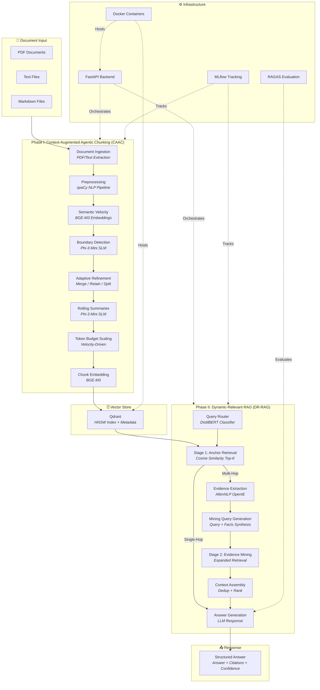
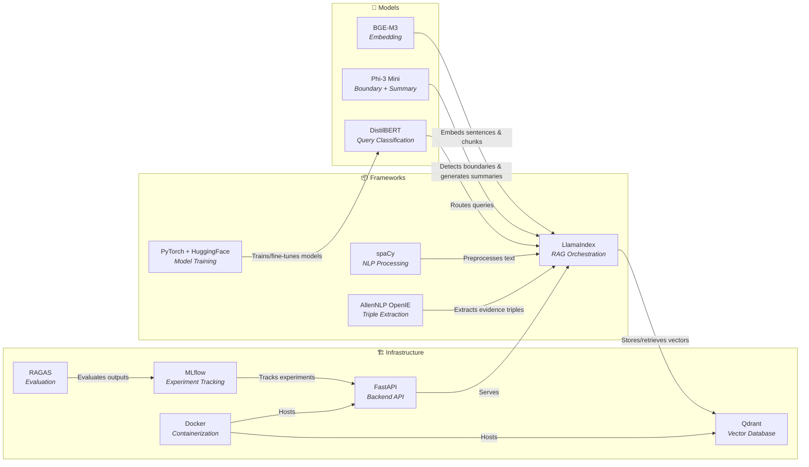
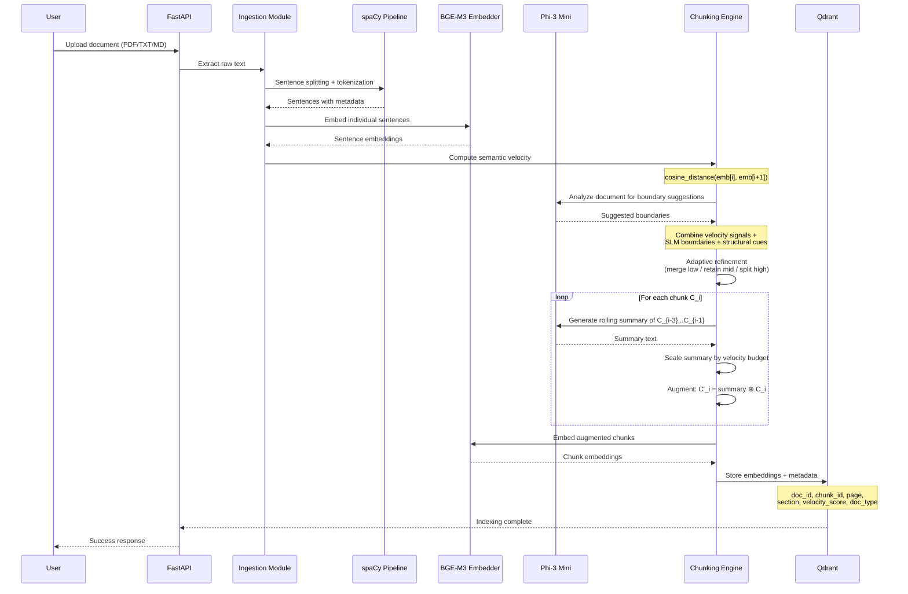
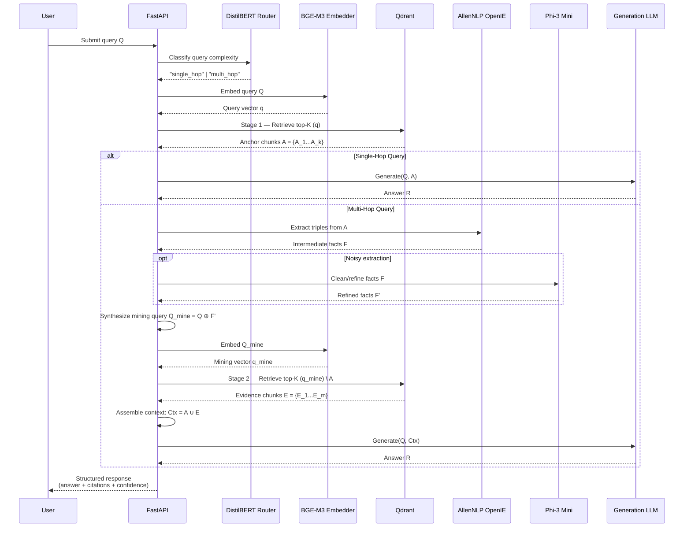
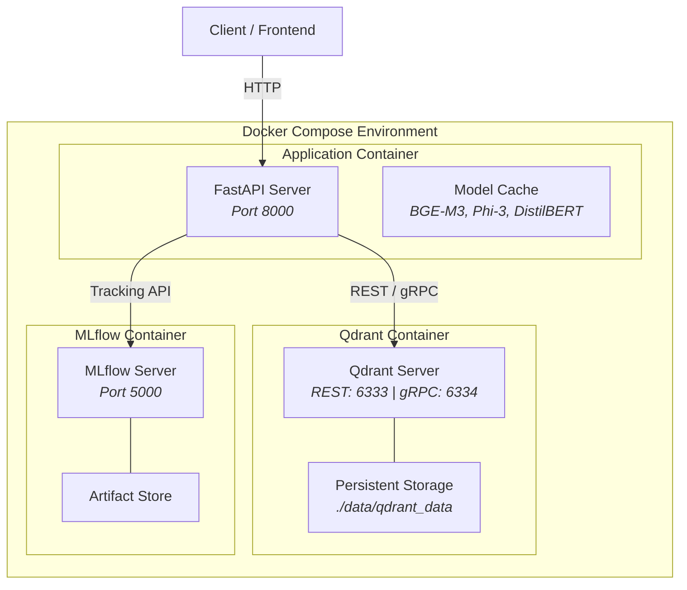

# System Architecture: Adaptive Semantic-Velocity Chunking with DR-RAG

## 1. Architecture Overview

The DR-RAG system is organized into two primary phases operating over a shared vector store, orchestrated through a FastAPI backend and tracked via MLflow.



---

## 2. Component Inventory

### 2.1 Phase I Components (Indexing Pipeline)

| Component | Module | Responsibility | Key Inputs | Key Outputs |
|---|---|---|---|---|
| **Document Ingestion** | `src/ingestion/` | Extract raw text from PDF, TXT, and MD files | Raw document files | Extracted text with page metadata |
| **Preprocessing** | `src/ingestion/` | Sentence splitting, tokenization, metadata extraction | Extracted text | Sentence list with metadata (page, section, position) |
| **Semantic Velocity** | `src/chunking/` | Compute embedding drift between adjacent sentences | Sentence embeddings (BGE-M3) | Velocity scores per sentence boundary |
| **Boundary Detection** | `src/chunking/` | Identify optimal semantic chunk boundaries | Velocity scores + document structure + SLM analysis | Boundary positions |
| **Adaptive Refinement** | `src/chunking/` | Merge low-velocity, retain moderate, split high-velocity regions | Initial chunks + velocity scores | Refined semantic chunks |
| **Rolling Summaries** | `src/chunking/` | Generate context summaries from preceding chunks | Previous 3 chunks | Summary text |
| **Token Budget Scaling** | `src/chunking/` | Scale summary length by semantic velocity magnitude | Velocity scores + summaries | Budget-scaled summaries |
| **Chunk Embedding** | `src/chunking/` | Embed augmented chunks (summary ⊕ chunk) into dense vectors | Augmented chunk text | Dense vector embeddings |

### 2.2 Phase II Components (Retrieval Pipeline)

| Component | Module | Responsibility | Key Inputs | Key Outputs |
|---|---|---|---|---|
| **Query Router** | `src/retrieval/` | Classify queries as single-hop or multi-hop | User query | Query class + routing decision |
| **Anchor Retrieval** | `src/retrieval/` | Retrieve top-K most similar chunks | Query embedding + Qdrant index | Anchor chunk set with scores |
| **Evidence Extraction** | `src/retrieval/` | Extract structured triples/propositions from anchors | Anchor chunks | Subject-relation-object triples |
| **Mining Query Gen** | `src/retrieval/` | Synthesize expanded query from original + extracted facts | Original query + intermediate facts | Mining query string |
| **Evidence Mining** | `src/retrieval/` | Second retrieval pass using mining query | Mining query embedding + Qdrant index | Evidence chunk set (deduplicated) |
| **Context Assembly** | `src/retrieval/` | Merge, deduplicate, and rank anchor + evidence chunks | Anchor set + evidence set | Final context pool |
| **Answer Generation** | `src/retrieval/` | Generate grounded answer from context pool | Query + context pool | Structured response |

### 2.3 Infrastructure Components

| Component | Module | Responsibility |
|---|---|---|
| **FastAPI Backend** | `src/api/` | REST API endpoints for ingestion, querying, and evaluation |
| **Qdrant Vector DB** | Docker service | HNSW-indexed vector storage with metadata filtering |
| **MLflow Tracking** | Infrastructure | Experiment tracking, metric logging, model versioning |
| **RAGAS Evaluation** | `src/evaluation/` | RAG-specific quality metrics (faithfulness, relevancy, precision, recall) |

---

## 3. Technology Mapping



---

## 4. Data Flow

### 4.1 Indexing Data Flow (Phase I)



### 4.2 Retrieval Data Flow (Phase II)



---

## 5. Module Directory Structure

The source code is organized to mirror the two-phase architecture:

```
src/
├── ingestion/                  # Phase I: Document ingestion
│   ├── __init__.py
│   ├── extractors.py           # PDF, TXT, MD text extraction
│   ├── preprocessor.py         # spaCy sentence splitting, metadata
│   └── document.py             # Document data model
│
├── chunking/                   # Phase I: CAAC pipeline
│   ├── __init__.py
│   ├── semantic_velocity.py    # Embedding drift computation
│   ├── boundary_detector.py    # SLM-guided boundary detection
│   ├── adaptive_refiner.py     # Merge/retain/split logic
│   ├── rolling_summary.py      # Summary generation + budget scaling
│   ├── chunk_embedder.py       # Augmented chunk embedding
│   └── models.py               # Chunk data models
│
├── retrieval/                  # Phase II: DR-RAG pipeline
│   ├── __init__.py
│   ├── query_router.py         # DistilBERT query classifier
│   ├── anchor_retrieval.py     # Stage 1 retrieval
│   ├── evidence_extractor.py   # AllenNLP OpenIE extraction
│   ├── mining_query.py         # Mining query synthesis
│   ├── evidence_miner.py       # Stage 2 retrieval
│   ├── context_assembler.py    # Dedup + rank + assemble
│   └── generator.py            # Answer generation
│
├── evaluation/                 # Evaluation framework
│   ├── __init__.py
│   ├── ragas_evaluator.py      # RAGAS metrics wrapper
│   ├── retrieval_metrics.py    # Recall@K, MRR computation
│   └── experiment_tracker.py   # MLflow integration
│
└── api/                        # FastAPI backend
    ├── __init__.py
    ├── main.py                 # App entry point
    ├── routes/
    │   ├── ingest.py           # Document upload endpoints
    │   ├── query.py            # Query endpoints
    │   └── evaluate.py         # Evaluation endpoints
    └── schemas.py              # Pydantic request/response models
```

---

## 6. Inter-Component Communication

All components communicate through well-defined Python data classes and Pydantic models. The system uses **synchronous in-process calls** for the prototype, with the option to introduce message queues for production scaling.

| Interface | From | To | Data Format |
|---|---|---|---|
| Document Upload | API | Ingestion | `DocumentUpload` Pydantic model |
| Preprocessed Text | Ingestion | Chunking | `PreprocessedDocument` dataclass (sentences + metadata) |
| Chunk Store | Chunking | Qdrant | `ChunkPayload` (embedding vector + metadata dict) |
| Query Request | API | Retrieval | `QueryRequest` Pydantic model |
| Retrieval Result | Qdrant | Retrieval | `ScoredPoint` (Qdrant native type) |
| Structured Response | Retrieval | API | `QueryResponse` Pydantic model |
| Evaluation Request | API | Evaluation | `EvaluationRequest` Pydantic model |
| Experiment Log | Evaluation | MLflow | MLflow tracking API |

---

## 7. Deployment Architecture


